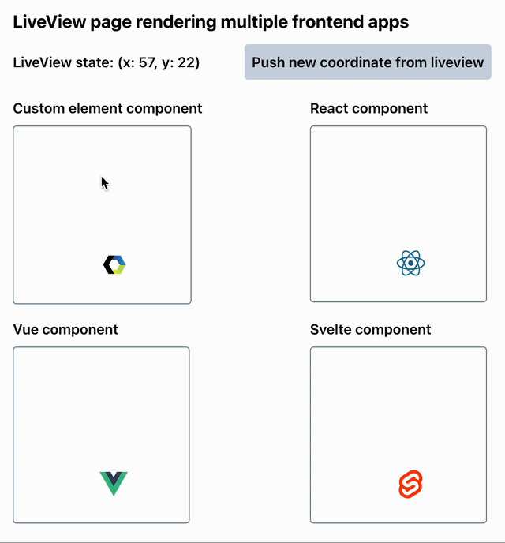

# Komodo

Use components from Javascript frameworks in your [Phoenix Liveview](https://hexdocs.pm/phoenix_live_view/Phoenix.LiveView.html) with ease!



NOTE: this library does **not** cover bundling/transpiling of components for each Javascript framework - it's concerned more with providing a standard interface for using the components in LiveView. However each README for supported frameworks will give pointers where necessary which should be enough to get it working.

## Background

Many Javascript frameworks allow for reusing components by employing a **props-in** (i.e. data), **callbacks-out** (or "events-out") model. Komodo allows for using these components in your Phoenix LiveView in the same way.

For example, if you were to use a React component like so:

```jsx
<MyReactComponent
  user={user}
  onChangeUser={(newUser) => handleUpdateUser(newUser)}
/>
```

then you could use this component from your LiveView like so:

```elixir
def render(assigns) do
  ~H"""
  <.js_component
    id="my-react-component"
    name="MyReactComponent"
    props={%{
      user: @user
    }}
    callbacks={%{
      onChangeUser: {"update_user", "&1"}
    }}
  />
  """
end

def handle_event("update_user", new_user, socket) do
  // ...
end
```

This assumes a Javascript component with the name `"MyReactComponent"` has been registered (see [Setup](#setup) below), using an adapter for the specific framework (in this case React).

Adapters are small pieces of Javascript code that wrap a framework component into a standardized JS component that is compatible with the code above.

See [Supported Adapters](#supported-adapters) below for supported frameworks and how to create adapters for other frameworks.

To understand how parameters are sent from callbacks to `handle_event`, see [Callback Parameters](#callback-parameters) below.

## Installation

This package is [on Hex](https://hexdocs.pm/komodo), so you can add`komodo` to your list of dependencies in `mix.exs`:

```elixir
def deps do
  [
    {:komodo, "~> 0.1.1"}
  ]
end
```

and run `mix deps.get`.

Add the javascript library to your assets `package.json`:

```js
"dependencies": {
  // ...
  "komodo": "file:../deps/komodo"
}
```

and install - `npm install --prefix assets`.

## Setup

Given a Phoenix app `MyApp`:

1. Import the provided components for use in heex templates

In `my_app_web.ex`:

```diff
defmodule MyAppWeb do

  # ...

  def html_helpers do
    # ...
+    import Komodo.Components
    # ...
  end

  # ...
end
```

2. Add the provided hook to the LiveSocket

In `app.js`:

```diff
// ...
+ import { registerJsComponents } from "komodo";

// ...

let liveSocket = new LiveSocket("/live", Socket, {
  // ...
  hooks: {
+    komodo: registerJsComponents({
+      // individual JS components will go here
+    })
  }
});

// ...
```

## Callback parameters

A string specification is used to tell `js_component` how to transform callback payloads into a `parameters` argument to send back to the liveview.
It makes use of the `&` to specify the argument number (which should already be familiar to Elixir users), as well as `.` and `[]` to access nested data.

For example, `"&1"` means the first argument, and `"&1.users[2]"` means the 3rd item in the users property of the first argument.

This should be intuitive as it follows Elixir/Javascript convention (note that the argument number `&1` starts from 1 whereas the array access index `[2]` starts from 0).

This will be better understood with an example...

Supposing the javascript component has a callback `onChangeTrack` that emits two arguments:

- the new song `{title: ""El Pocito"}`
- the artist `{name: "Vicente Amigo"}`

i.e. in javascript you would do something like

```jsx
onChangeTrack={(newSong, newArtist) => handleChangeTrack(...)}
```

Then the liveview will have

```elixir
def render(assigns) do
  ~H"""
  <.js_component
    ...
    callbacks={%{
      onChangeTrack: ???
    }}
  />
  """
end

def handle_event("change_track", parameters, socket) do
  // ...
end
```

The table below shows what to put in place of `???` to form the `parameters` argument given to `handle_event`.

| Callback spec (`???`)                                      | `parameters`                                   | Notes                                       |
| ---------------------------------------------------------- | ---------------------------------------------- | ------------------------------------------- |
| `"change_track"`                                           | `%{}`                                          | Defaults to an empty map                    |
| `{"change_track", "&1"}`                                   | `%{"title" => "El Pocito"}`                    | The first argument                          |
| `{"change_track", "&1.title"}`                             | `"El Pocito"`                                  | Something nested inside the first argument  |
| `{"change_track", ["&1.title", "&2.name"]}`                | `["El Pocito", "Vicent Amigo"]`                | A list combining elements of both arguments |
| `{"change_track", %{song: "&1.title", artist: "&2.name"}}` | `%{song: "El Pocito", artist: "Vicent Amigo"}` | A map combining elements of both arguments  |

Many frameworks will only have one argument so you will often be using `"&1.xxx"` etc.

## Supported adapters

Simple adapters for the following are provided

- [Svelte](https://github.com/hungry-egg/komodo/tree/main/packages/komodo-svelte)
- [React](https://github.com/hungry-egg/komodo/tree/main/packages/komodo-react)
- [Vue](https://github.com/hungry-egg/komodo/tree/main/packages/komodo-vue)

Additionally, the `komodo` package provides an adapter for working with custom elements.

## Custom elements adapter

Some libraries like Angular (as well as Vue, Svelte) can compile to the web browser-standard [custom elements](https://developer.mozilla.org/en-US/docs/Web/API/Web_components). A simple adapter is provided for using these.

### Example

A custom element `message-log` that takes a `messages` prop and emits a custom event (using the native `dispatchEvent`) `remove-message` could be used from liveview with

```elixir
def render(assigns) do
  ~H"""
  <.js_component
    id="msg-log"
    name="MessageLog"
    props={%{
      messages: @messages
    }}
    callbacks={%{
      "remove-message": {"remove_message", "&1.detail.id"}
    }}
  />
  """
end

def handle_event("remove_message", message_id, socket) do
  // ...
end
```

This would be registered in `app.js` with:

```diff
// ...
+ import { registerJsComponents, componentFromElement } from "komodo";

// ...

let liveSocket = new LiveSocket("/live", Socket, {
  // ...
  hooks: {
+    komodo: registerJsComponents({
+      MessageLog: componentFromElement("message-log")
+    })
  }
});

// ...
```

Note that depending on whether this is already done for you or not you may also need to [register the custom element](https://developer.mozilla.org/en-US/docs/Web/API/CustomElementRegistry/define) with the browser, e.g. in `app.js`:

```
window.customElements.define("message-log", MessageLogElement);
```

## Custom Adapters

Adapters for each framework are small and easy to write for new libraries.
Everything registered with the `registerJsComponents` hook

```js
komodo: registerJsComponents({
  MyComponent: MyComponent,
});
```

like `MyComponent` above, has the form

```js
{
  // Called once on mount
  mount: ( el, initialProps, callbackNames, emit) {
    // el:
    // the container element, a div by default

    // initialProps:
    // a {propName: value} lookup where values can anything JSON-friendly

    // callbackNames:
    // If <.js_component.../> was called with callbacks={%{cb1: ..., cb2: ...}} then this will
    // be the array of names only, i.e. ["cb1", "cb2"]

    // emit:
    // a standard interface for callbacks, e.g. emit("callbackName", arg1, arg2)
    // In general the adapter won't change the callback name / arguments when calling this
    // Any mapping to the parameters received by handle_event is done in the liveview

    // Whatever you return from mount will be passed as the first arg to update and unmount
    return {
      some: "context"
    }
  },

  // Called whenever props change
  update: (context, newProps) {
    // context:
    // Whatever was returned from mount()

    // newProps:
    // the new props (all of them, including unchanged ones), as a {propName: value} lookup
  }

  // Called on unmount for cleaning up resources
  unmount: (context) {
    // context:
    // Whatever was returned from mount()
  }
}
```

A Typescript type, [JsComponent](packages/komodo/src/js-component.ts), is given that can be used when working with Typescript.

The easiest way to create an adapter for another library is probably looking at one of the other adapters and doing something similar.

If creating an adapter for some framework "Framework-X", then the convention would be to create a factory function

```ts
const componentFromFrameworkX: (Component: FrameworkXComponent) => JsComponent;
```

that could be used in `app.js` like so:

```diff
// ...
+ import { registerJsComponents } from "komodo";
+ import componentFromFrameworkX from "komodo-framework-x";
+ import FrameworkXSlider from "path/to/framework-x/slider";

// ...

let liveSocket = new LiveSocket("/live", Socket, {
  // ...
  hooks: {
+    komodo: registerJsComponents({
+      Slider: componentFromFrameworkX(FrameworkXSlider)
+    })
  }
});

// ...
```
